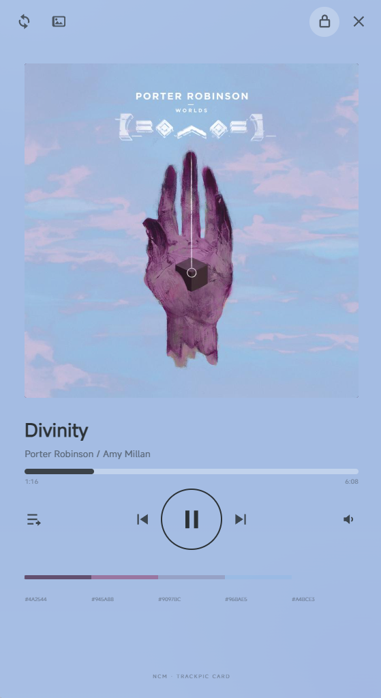
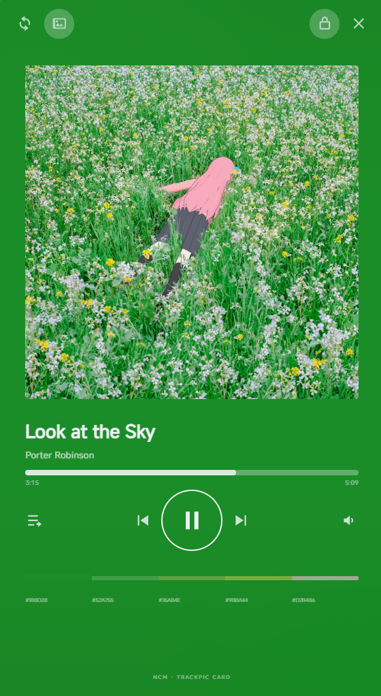

# NCM Track Card

一个把网易云音乐客户端的播放状态镜像到桌面悬浮卡片，可自定义封面和背景颜色的工具：正面是封面卡片，背面是逐字滚动的歌词。




## 工作原理

```
网易云客户端 (CEF)
   │  本机调试通道 127.0.0.1:9223        ← 客户端必须带这个参数启动
   ▼
宿主进程 (packages/host)  ──WebSocket 127.0.0.1:8787──▶  卡片界面 (ui/)
   │  读取播放状态 / 歌词 / 封面，发送播放控制
   ▼
Electron 外壳 (apps/overlay)：无边框透明窗口、托盘、拖拽、自动收起、自选封面
```

**关键前提**：客户端必须带 `--remote-debugging-address=127.0.0.1 --remote-debugging-port=9223` 启动，
这个通道只在启动时开启。如果卡片显示"客户端没开同步通道"，点状态栏里的**重启客户端**按钮即可
（它会把客户端按正确参数重启）；也可以运行 `npm run relaunch`。

## 安装（普通用户）

1. 运行 `NCM Track Card-<版本>-setup.exe`（按用户安装，不需要管理员）；
2. 装完会自动启动，之后**开机自启**（可在 Windows 设置 → 应用 → 启动 里关掉）；
3. 第一次运行如果找不到客户端，卡片下方会出现**启动客户端**按钮，点一下即可。

不想安装的话，`-portable.exe` 是免安装版，双击即用（不会写安装信息，也不会自动设置开机自启）。

## 从源码运行（开发）

```bash
npm install
npm run overlay        # 启动卡片（会自动拉起宿主）
npm run host           # 只跑宿主，在终端里看播放状态流
npm run check          # 全部静态检查（编码 / 布局 / 桥接 / 交互 / 外壳）
npm test               # 单元测试
npm run dist           # 打安装包 + 免安装版到 dist/
npm run check:package  # 检查刚打出来的产物（导入图完整，并真的跑一次打包后的宿主）
```

## 用法

| 操作 | 效果 |
| --- | --- |
| 鼠标移上去 | 展开卡片；移开自动收起（`L` 或锁形键可锁定不收起） |
| 拖动卡片 | 移动位置，可以拖到屏幕边缘外，只留一小块以便抓回 |
| 左上角 ↑ | 翻面 / 翻回（`F`） |
| 左上角 🖼 | 自选封面：左键选图（再点=开关），右键清除 |
| 托盘图标 | 单击显示 / 隐藏；右键菜单只有 小 / 中 / 大 / 退出 |
| 进度条 | 拖动跳转（暂停时也会延后到恢复播放时生效） |

## 源码结构

| 位置 | 内容 |
| --- | --- |
| `packages/host/` | 宿主：CDP 桥接、状态与歌词处理、WebSocket、静态服务 |
| `ui/` | 卡片界面：零构建的原生 ES 模块 + CSS，浏览器里也能开 |
| `apps/overlay/` | Electron 外壳：窗口、托盘、拖拽、收起、自选封面、打包入口 |
| `tools/` | 探针与检查脚本（`check-*.mjs`）、图标生成、打包辅助 |
| `assets/` | 图标（`icon.ico` 多尺寸、矢量源、导出图） |
| `docs/contracts.md` | 与客户端之间实测出来的契约（调试通道 API、枚举、限制） |
| `NOTES.md` | 踩过的坑与每轮决策的原因（按时间） |

## 已知限制

- 只在 Windows 上测过；调试通道、托盘、开机自启都是 Windows 行为；
- 客户端更新后调试通道的模块编号可能变化（宿主按形状发现模块，不写死编号）；
- 自定义封面暂只支持.jpg，.png文件。
